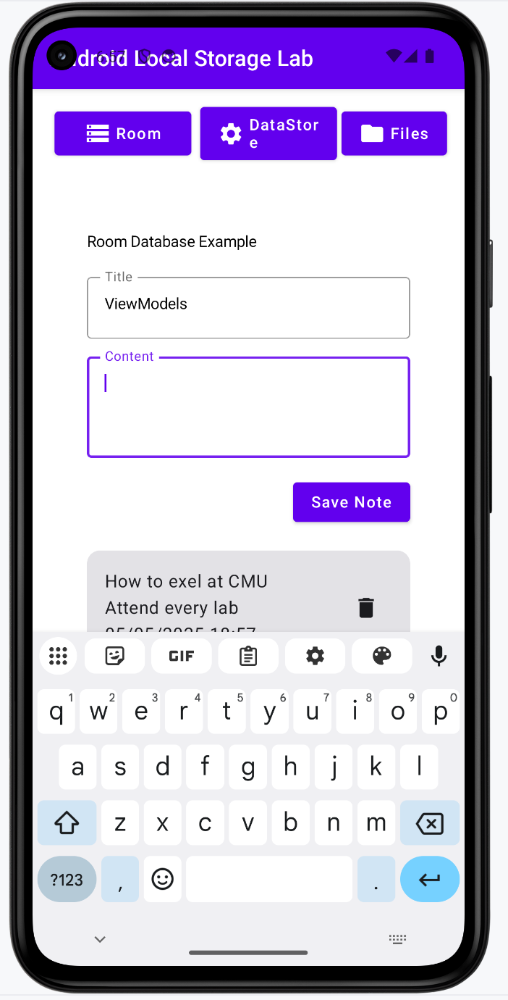

# Mobile and Ubiquitous Computing

## MEIC/METI 2025/2026

# Lab Guide 3

## Local storage and Android Back-ends

---

### Objectives

In this lab, you will learn about local storage in Android and how to use back-ends

* How to use Android Room to create a database for your app;
* How to store settings in the DataStore;
* How to create and store files.

This lab is designed for **autonomous learning**: follow the instructions, explore the official documentation when needed, and work at your own pace. You can discuss with colleagues, but each student must complete their own work.

#### Material:

* [Class Slides](slides/cmu-lab3.pdf)

---

## Preparation for this guide

Add the following dependencies:

```kotlin

dependencies {

    // Compose View Model
    implementation("androidx.lifecycle:lifecycle-viewmodel-compose:2.10.0")

    // Extended Icons
    implementation("androidx.compose.material:material-icons-extended")

    // Room
    val roomVersion = "2.8.4"
    implementation("androidx.room:room-runtime:$roomVersion")
    ksp("androidx.room:room-compiler:$roomVersion")
    implementation("androidx.room:room-ktx:$roomVersion")
    implementation("androidx.room:room-paging:$roomVersion")

    //navigation
    val navVersion = "2.9.8"
    implementation("androidx.navigation:navigation-fragment:$navVersion")
    implementation("androidx.navigation:navigation-ui:$navVersion")

    // DataStore
    implementation("androidx.datastore:datastore-preferences:1.2.1")
    implementation("androidx.datastore:datastore-preferences-rxjava2:1.2.1")
    implementation("androidx.datastore:datastore-preferences-rxjava3:1.2.1")

    // Coroutines
    implementation("org.jetbrains.kotlinx:kotlinx-coroutines-android:1.10.2")

    //supabase
    val supabaseVersion = "3.6.0"
    implementation("io.github.jan-tennert.supabase:postgrest-kt:$supabaseVersion")
    implementation("io.github.jan-tennert.supabase:storage-kt:$supabaseVersion")
    implementation("io.github.jan-tennert.supabase:auth-kt:$supabaseVersion")
    val ktorVersion = "3.4.3"
    implementation("io.ktor:ktor-client-android:$ktorVersion")
    implementation("io.ktor:ktor-client-core:$ktorVersion")
    implementation("io.ktor:ktor-utils:$ktorVersion")
 
    ...
}
```

You'll also need to add this line to the plugins:

```kotlin
plugins {
    ....
    alias(libs.plugins.google.ksp)
}
```

Due to the most recent versions of Gradle please make sure in your `libs.versions.toml` file you have the following versions plugins:

```kotlin
[versions]
agp = "9.2.0"
coreKtx = "1.18.0"
junit = "4.13.2"
junitVersion = "1.3.0"
espressoCore = "3.7.0"
lifecycleRuntimeKtx = "2.10.0"
activityCompose = "1.13.0"
kotlin = "2.3.21"
composeBom = "2026.04.01"
ksp = "2.3.7"
...
[plugins]
android-application = { id = "com.android.application", version.ref = "agp" }
kotlin-compose = { id = "org.jetbrains.kotlin.plugin.compose", version.ref = "kotlin" }
google-ksp = { id = "com.google.devtools.ksp", version.ref = "ksp" }
```

---

## Exercise 1 – Build a Notes app with local storage in the database



Start by creating a database file: `NoteDatabase.kt`

```kotlin
@Database(entities = [Note::class], version = 1, exportSchema = false)
abstract class NoteDatabase : RoomDatabase() {
    abstract fun noteDao(): NoteDao

    companion object {
        @Volatile
        private var INSTANCE: NoteDatabase? = null

        fun getDatabase(context: Context): NoteDatabase {
            return INSTANCE ?: synchronized(this) {
                val instance = Room.databaseBuilder(
                    context.applicationContext,
                    NoteDatabase::class.java,
                    "note_database"
                ).build()
                INSTANCE = instance
                instance
            }
        }
    }
}
```

Then, create a Note entity. It represents the Notes tabla (`Note.kt`).

```kotlin

@Entity(tableName = "notes")
data class Note(
    @PrimaryKey(autoGenerate = true) val id: Int = 0,
    val title: String,
    val content: String,
    val timestamp: Long = System.currentTimeMillis()
)

```

The `NoteDAO.kt` is your Data Access Object:

```kotlin
@Dao
interface NoteDao {
    @Query("SELECT * FROM notes ORDER BY timestamp DESC")
    fun getAllNotes(): Flow<List<Note>>

    @Insert
    suspend fun insertNote(note: Note)

    @Delete
    suspend fun deleteNote(note: Note)
}

```

Congratulations, you've build your first database. Every database in Android Room is composed of three elements: the entities, the database object and the DAO.

It is a good practice to use a repository. The idea is to have an abstraction of the database. This will be useful in the future when your app is synchronized with a back-end.

```kotlin

class NoteRepository(private val noteDao: NoteDao) {
    val allNotes: Flow<List<Note>> = noteDao.getAllNotes()

    suspend fun insert(note: Note) {
        noteDao.insertNote(note)
    }

    suspend fun delete(note: Note) {
        noteDao.deleteNote(note)
    }
}

```

Now, create a ViewModel to implement the logic of the app. You can adapt the viewmodel from the previous lab.

```kotlin

class NoteViewModel(application: Application) : AndroidViewModel(application) {
    private val repository: NoteRepository
    val allNotes: StateFlow<List<Note>>

    private val _noteTitle = MutableStateFlow("")
    val noteTitle: StateFlow<String> = _noteTitle

    private val _noteContent = MutableStateFlow("")
    val noteContent: StateFlow<String> = _noteContent

    init {
        val noteDao = NoteDatabase.getDatabase(application).noteDao()
        repository = NoteRepository(noteDao)
        allNotes = repository.allNotes.stateIn(
            viewModelScope,
            SharingStarted.WhileSubscribed(5000),
            emptyList()
        )
    }

    fun updateTitle(title: String) {
        _noteTitle.value = title
    }

    fun updateContent(content: String) {
        _noteContent.value = content
    }

    fun saveNote() {
        val title = noteTitle.value
        val content = noteContent.value

        if (title.isNotBlank() || content.isNotBlank()) {
            viewModelScope.launch {
                repository.insert(Note(title = title, content = content))
                _noteTitle.value = ""
                _noteContent.value = ""
            }
        }
    }

    fun deleteNote(note: Note) {
        viewModelScope.launch {
            repository.delete(note)
        }
    }
}

```

Finally, create a composable for the UI:

```kotlin

@Composable
fun NoteScreen(viewModel: NoteViewModel = viewModel(), innerPadding: PaddingValues) {
    val notes by viewModel.allNotes.collectAsState()
    val title by viewModel.noteTitle.collectAsState()
    val content by viewModel.noteContent.collectAsState()

    Column(
        modifier = Modifier
            .fillMaxSize()
            .padding(innerPadding.calculateTopPadding())
    ) {
        Text(
            text = "Room Database Example",
            modifier = Modifier.padding(bottom = 16.dp)
        )

        // Input fields
        OutlinedTextField(
            value = title,
            onValueChange = { viewModel.updateTitle(it) },
            label = { Text("Title") },
            modifier = Modifier.fillMaxWidth()
        )

        Spacer(modifier = Modifier.height(8.dp))

        OutlinedTextField(
            value = content,
            onValueChange = { viewModel.updateContent(it) },
            label = { Text("Content") },
            modifier = Modifier
                .fillMaxWidth()
                .height(100.dp)
        )

        Spacer(modifier = Modifier.height(16.dp))

        Button(
            onClick = { viewModel.saveNote() },
            modifier = Modifier.align(Alignment.End)
        ) {
            Text("Save Note")
        }

        Spacer(modifier = Modifier.height(16.dp))

        LazyColumn {
            items(notes) { note ->
                NoteItem (
                    note = note,
                    onDelete = { viewModel.deleteNote(note) }
                )
            }
        }
    }
}


@Composable
fun NoteItem(note: Note, onDelete: () -> Unit) {
    Card(
        modifier = Modifier
            .fillMaxWidth()
            .padding(vertical = 4.dp)
    ) {
        Row(
            modifier = Modifier
                .fillMaxWidth()
                .padding(16.dp),
            horizontalArrangement = Arrangement.SpaceBetween,
            verticalAlignment = Alignment.CenterVertically
        ) {
            Column(modifier = Modifier.weight(1f)) {
                Text(
                    text = note.title
                )
                Text(
                    text = note.content
                )
                Text(
                    text = SimpleDateFormat("MM/dd/yyyy HH:mm", Locale.getDefault())
                        .format(Date(note.timestamp))
                )
            }

            IconButton(onClick = onDelete) {
                Icon(Icons.Default.Delete, contentDescription = "Delete")
            }
        }
    }
}

```

Include this composable in the Main Activity to see the result. 

*******


## Exercise 2 - Make your Notes app sync with a backend

By the end of this lab, you will:
* Set up a Supabase backend.
* Connect an Android app to Supabase.
* Store and retrieve notes using Supabase instead of Room.
* Understand Supabase’s REST and realtime capabilities in a mobile context.

### Part 1: Supabase Project Setup

1 - Go to https://supabase.com, log in, and create a new project.
2 - Under Table Editor, create a table called notes with the following columns:
* id – Int4 - Primary Key
* title – Text
* content – Text
* timestamp – Int8


3 - Still under Table Editor, go to `Connect` (top left corner), select `Framework` -> `Android Kotlin` and save the sample code for **Part 2** **Step 2**

4 - On the table editor, click on the three dots (...) by the table Notes ->  View Policies -> Create Policy (top right corner)
 and fill with the following:

* Policy name: `Insert notes`
* Table: `public.notes`
* Policy Behavior: `Permissive`
* Policy Command: `ALL`

* USE OPTIONS ABOVE TO EDIT (complete the code):

```sql
create policy "Insert notes"
on "public"."notes"
to public
using (
     true
)
with check (
    true
);
```


### Part 2: Add Supabase to Android App

#### Step 1: Add Supabase Kotlin SDK


Add the following plugin to your `build.gradle`(app module):
```kotlin
plugins {
    ...
    id("org.jetbrains.kotlin.plugin.serialization") version "2.3.21"
    ...
}
```


Add the following to your `build.gradle` (app module):

```kotlin
dependencies {
    //supabase
    val supabaseVersion = "3.6.0"
    implementation("io.github.jan-tennert.supabase:postgrest-kt:$supabaseVersion")
    implementation("io.github.jan-tennert.supabase:storage-kt:$supabaseVersion")
    implementation("io.github.jan-tennert.supabase:auth-kt:$supabaseVersion")

    val ktorVersion = "3.4.3"
    implementation("io.ktor:ktor-client-android:$ktorVersion")
    implementation("io.ktor:ktor-client-core:$ktorVersion")
    implementation("io.ktor:ktor-utils:$ktorVersion")
}
```

(*To learn more about how to setup an Android project with supabase, pleach check the official documentation [here](https://supabase.com/docs/guides/getting-started/tutorials/with-kotlin)*)

In your `AndroidManifest.xml`, allow internet access:

```xml
<uses-permission android:name="android.permission.INTERNET"/>
```

#### Step 2: Initialize Supabase Client

Create a `SupabaseClient.kt`:

```kotlin
val supabase = createSupabaseClient(
    supabaseUrl = "YOUR_PROJECT_URL",
    supabaseKey = "YOUR_PROJECT_KEY"
  ) {
    install(Postgrest)
}


```


#### Part 3: Replace Repository with Supabase Logic

Create a new `SupabaseNoteRepository` with a Supabase-powered version:

```kotlin
class SupabaseNoteRepository {
    private val notesTable = SupabaseClient.supabase.postgrest["notes"]

    fun getAllNotes(): Flow<List<Note>> = flow {
        val result = notesTable.select().decodeList<Note>()
        emit(result)
    }

    suspend fun insert(note: Note) {
        notesTable.insert(note)
    }

    suspend fun delete(note: Note) {
        notesTable.delete {
            filter{
                eq("id", note.id)
            }
        }
    }
}

```


Update your `Note.kt` file: 

```kotlin
@Serializable
@Entity(tableName = "notes")
data class Note(
    @PrimaryKey(autoGenerate = true)
    val id: Int = 0,
    val title: String,
    val content: String,
    val timestamp: Long = System.currentTimeMillis()
)
```

#### Part 4: Update the ViewModel

```kotlin

class NoteViewModel(application: Application) : AndroidViewModel(application) {
    //private val repository: NoteRepository
    private val repository = SupabaseNoteRepository()
    val allNotes: StateFlow<List<Note>>

    private val _noteTitle = MutableStateFlow("")
    val noteTitle: StateFlow<String> = _noteTitle

    private val _noteContent = MutableStateFlow("")
    val noteContent: StateFlow<String> = _noteContent

    private val _noteId = MutableStateFlow(0)
    val noteId: StateFlow<Int> = _noteId


    init {
        val noteDao = NoteDatabase.getDatabase(application).noteDao()
        //repository = NoteRepository(noteDao)
        allNotes = repository.getAllNotes().stateIn(
            viewModelScope,
            SharingStarted.WhileSubscribed(5000),
            emptyList()
        )
    }

    fun updateTitle(title: String) {
        _noteTitle.value = title
    }

    fun updateContent(content: String) {
        _noteContent.value = content
    }

    fun updateId(id: Int){
        _noteId.value = id
    }

    fun saveNote() {
        val id = noteId.value
        val title = noteTitle.value
        val content = noteContent.value

        if (title.isNotBlank() || content.isNotBlank()) {
            viewModelScope.launch {
                repository.insert(Note(id = id, title = title, content = content))
                _noteTitle.value = ""
                _noteContent.value = ""
            }
        }
    }

    fun deleteNote(note: Note) {
        viewModelScope.launch {
            repository.delete(note)
        }
    }
}

```

Now test your application and see if the notes you create are synced to SupaBase

### Part 5 - Complete your app

With these changes, the Notes App no longer stores data in the Android Room database. However, it's desirable to keep the most recent notes in Room as a local cache. This helps reduce data usage and improves performance when the app is offline or has limited connectivity.

A good practice in Android architecture is to let the repository layer decide where to fetch data from—locally or remotely—based on availability, freshness, or connectivity.

Your task now is to adapt the repository to first fetch notes from the local database, and then update the local cache with the latest notes from Supabase.